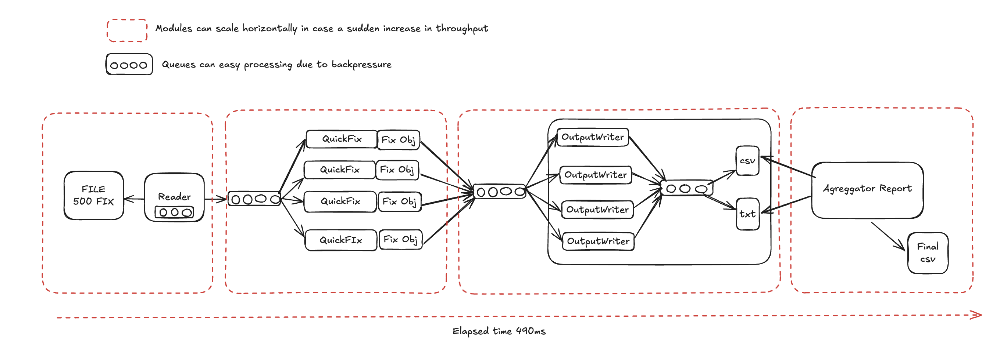

# FIX Message Handler

## Overview

This Java program efficiently handles high-volume FIX message processing, storage, and retrieval.




## Architecture

The program employs a multi-threaded architecture with several key components:

* **Message Ingestion:** Raw FIX messages are received and placed into an input queue.

* **Message Processing:**

    * `FixMessageEnrichWorker`: Worker threads consume raw FIX messages from the input queue, parse and enrich them, and place the processed messages into an output queue.
    * Employs a thread pool to process messages concurrently, improving throughput.

* **Data Aggregation and Reporting:**

    * `FixExecutionHandlerManager`: Manages the processed messages.
    * Reads messages from the output queue, aggregates data, and writes it to files.

* **Queues:**

    * `BlockingQueue<List<RawFixMessage>>`: Holds batches of raw FIX messages before processing.
    * `BlockingQueue<List<Message>>`: Holds batches of processed messages after enrichment.
    * `ConcurrentLinkedQueue<String>`: (allMessagesQueue, fullFillQueue) Used for non-blocking storage of strings to be written to the respective files.

## Performance Enhancements

The program improves performance through:

* **Batching:** Processing and writing messages in batches reduces I/O overhead.
* **Multi-threading:** Concurrent message processing and file writing increase throughput.
* **File Buffering:** `BufferedWriter` reduces disk I/O operations.
* **Concurrent Queues:** Thread-safe queues prevent bottlenecks and improve scalability.

## Scalability

Queues are key to this design's scalability. They decouple message processing and file writing, enabling:

* **Independent Scaling:** Scale processing and writing components separately.
* **Load Balancing:** Queues buffer message spikes.
* **Asynchronous Processing:** Processing doesn't wait for writing, improving speed.

This allows the system to handle high message volumes and adapt to changing load conditions.

## Areas for Improvement

The writer modules, specifically `FileWriterTask` and `writeBatchToFile`, could be improved in:

* **Error Handling:** Implement robust error handling (e.g., retry, dead-letter queue).
* **File Rotation:** Add file rotation for long-running applications.
* **Storage:** Consider a database or message queue for more reliable storage.
* **File I/O:** Use asynchronous file I/O to improve performance.
* **Asynchronous Processing:** Explore fully asynchronous application design.
* **Ring Buffer:** Use a ring buffer (e.g., Chronicle Queue) for efficient data storage and retrieval.

## How to Run the Program

1.  **Prerequisites:**

    * Java 8 or later.
    * Maven.

2.  **Build the project:**

    ```
    mvn clean install
    ```

3.  **Run the application with flag options:**

    * **To generate mock FIX messages:**

        ```bash
        java org.ib.fix.FixMessageProcessingApp --generate-mock
        ```

      This command executes the app in mock FIX mode, generating "fix_messages.txt" and then exiting. Useful for testing.

    * **To process FIX messages from file:**

        ```bash
        java org.ib.fix.FixMessageProcessingApp
        ```

      Running without flags processes FIX messages from "fix_messages.txt" (the default mode).

## FIX Message Generator

`FixMessageGenerator` creates mock FIX messages for testing.

